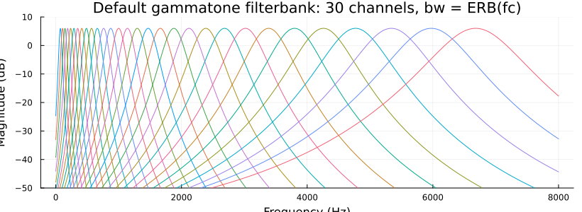
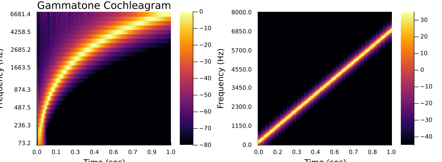
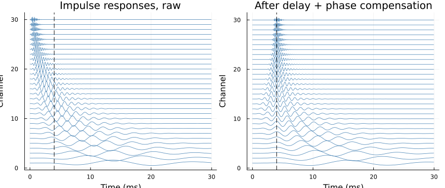

```@meta
CurrentModule = TimeFrequencyAnalysis
```

# Gammatone Filterbank

Auditory-model time-frequency analysis after Hohmann (2002). Each channel of the bank is a
**complex gammatone filter** — a cascade of ``γ`` (= `order`, default 4) identical one-pole
complex filters

```math
H(z) = k\,(1 - ã z^{-1})^{-γ}, \qquad ã = λ e^{iβ}, \quad β = \frac{2π f_c}{f_s},
```

whose output is a complex subband signal: its magnitude is the band's envelope and its
angle the fine structure. The normalisation ``k = 2(1-λ)^{γ}`` places the peak of the
magnitude response exactly at the centre frequency with gain exactly 2, so that for a real
input the subband magnitude carries the band's amplitude and the real part is the
bandpass-filtered signal itself. The impulse response is known in closed form,
``h[n] = k\binom{n+γ-1}{γ-1}\,ã^{\,n}`` — that closed form is what
[`impulse_response`](@ref) evaluates, and the recursive kernel is tested against it.

Bandwidths default to the auditory equivalent rectangular bandwidth
``\mathrm{ERB}(f_c) = 24.7 + f_c/9.265`` Hz ([`erb`](@ref)); they can be scaled
(`bw_scale`) or set outright (`bw`, per filter or per channel), and are realised either as
the filter's own equivalent rectangular bandwidth (the default; Hohmann's Eqs. 13–17) or
with the band edges placed a given number of dB below the peak (`attenuation_db`, the
explicit form used by the reference implementations). Centre frequencies are uniformly
spaced on the ERB-rate scale with one channel pinned exactly at a base frequency — see
[`erbfreq_array`](@ref) for the anchoring logic.



## Analyses

[`gammatone_analysis`](@ref) returns the complex subbands of a signal as a
[`timefreq`](@ref) with **per-sample time resolution** (no framing), and
[`gammatone_cochleagram`](@ref) returns their envelope, floored like [`specgram`](@ref) so
dB scaling is always well defined. Both follow the package's [`comp()`](@ref comp)
convention for bare-array output and plot through the existing recipes:

```julia
using TimeFrequencyAnalysis, Plots

s  = signal(x, 16000)                  #a signal container at 16 kHz
fb = gammatone_filterbank(16000.0)     #30 ERB-spaced channels, 70 Hz – 6.7 kHz
cg = gammatone_cochleagram(s, fb)      #envelope timefreq at the full signal rate
plot(amp2db(cg); clims = (-80, 0))
```



The cochleagram of a linear chirp (left) against the `specgram` of the same signal
(right): the chirp bends on the cochleagram because its frequency axis is uniform in
ERB-rate rather than in Hz, and the slow low channels smear time where the fast high
channels track it sharply.

## Delays and alignment

Gammatone channels are slow at low frequencies and fast at high ones, and two delay
notions matter when interpreting or aligning their outputs: the group delay at the centre
frequency ([`group_delay`](@ref), ≈ `order/(2πb)`) and the slightly earlier peak of the
impulse-response envelope ([`envelope_delay`](@ref), ≈ `(order-1)/(2πb)`), which is what
alignment across channels targets. [`summed_resp`](@ref) shows the bank's summed
frequency response with and without alignment.

That alignment is [`gammatone_delay`](@ref): per-channel integer delays and unit phase
factors, measured from the bank's impulse responses exactly as in the reference
implementations, applied with [`compensate`](@ref)/[`compensate!`](@ref) or folded into
the analyses with their `align` keyword. Channels too slow to reach their envelope peak
within the target delay (normal at the bottom of the bank) are left unshifted. After
compensation the channels' envelopes and fine structure meet at the target delay, and the
summed subbands reconstruct an impulse there — the basis of the resynthesis (mixer +
summation) stage planned as the next iteration of this framework.

```julia
d  = gammatone_delay(fb; delay = 0.004)        #4 ms alignment target
Ya = gammatone_analysis(s, fb; align = 0.004)  #aligned complex subbands
```



## Function reference

```@docs
gammatone_filter
impulse_response
gammatone_filt
gammatone_filt!
gammatone_filterbank
gammatone_analysis
gammatone_cochleagram
group_delay
envelope_delay
summed_resp
gammatone_delay
compensate
compensate!
```

## References

- V. Hohmann (2002), "Frequency analysis and synthesis using a Gammatone filterbank",
  *Acta Acustica united with Acustica* 88(3), 433–442.
- B. R. Glasberg, B. C. J. Moore (1990), "Derivation of auditory filter shapes from
  notched-noise data", *Hearing Research* 47, 103–138.
- Reference implementations this one is cross-validated against: Hohmann's original
  MATLAB (`gfb_*`, <https://zenodo.org/records/2643400>), the Auditory Modeling Toolbox
  (`hohmann2002*`, <https://www.amtoolbox.org>), and pyfilterbank
  (<https://github.com/SiggiGue/pyfilterbank>).
